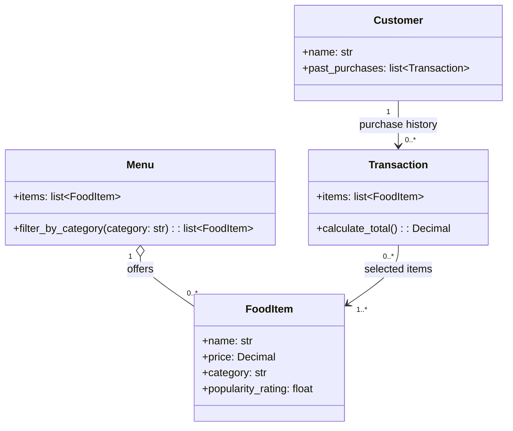

# ByteBites UML Class Diagram

```mermaid
classDiagram
    class Customer {
        +name: str
        +past_purchases: list~Transaction~
    }

    class FoodItem {
        +name: str
        +price: Decimal
        +category: str
        +popularity_rating: float
    }

    class Menu {
        +items: list~FoodItem~
        +filter_by_category(category: str): list~FoodItem~
    }

    class Transaction {
        +items: list~FoodItem~
        +calculate_total(): Decimal
    }

    Menu "1" o-- "0..*" FoodItem : offers
    Customer "1" --> "0..*" Transaction : purchase history
    Transaction "0..*" --> "1..*" FoodItem : selected items
```
